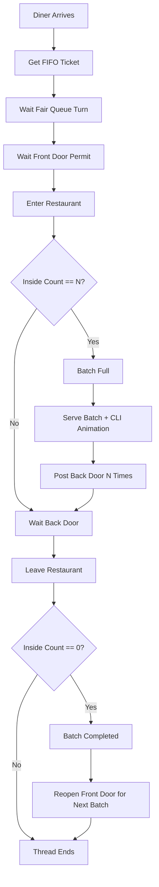

# BatchServe

<p align="center">
	
</p>

<p align="center">
	
	
	
	
	
</p>

<p align="center">
	
	
	
</p>

---

## Visual Overview

BatchServe simulates a restaurant serving diners in strict cycles:

1. Front door opens for exactly N diners.
2. Batch fills and service begins.
3. Back door opens after service.
4. All diners leave.
5. Next batch starts only after full exit.

It demonstrates core Operating Systems synchronization concepts with clean logs, fairness guarantees, starvation monitoring, and terminal animation.

---

## Architecture Flow



---

## Feature Highlights

| Feature | What You See | Why It Matters |
|---|---|---|
| Colored Logs | Distinct colors for queue, enter, serve, leave, warnings | Easier to track concurrent behavior |
| Batch IDs | `[BATCH 01]`, `[BATCH 02]`, ... in logs | Clear phase grouping per cycle |
| FIFO Fairness Queue | Ticket-based diner ordering | Prevents random overtaking |
| Starvation Handling | Wait time printed; warning threshold alerts | Surfaces long waits and fairness health |
| CLI Animation | Spinner-based serving animation | Makes runtime state immediately visible |
| Strict Capacity | Maximum N diners inside | Enforces system constraint correctly |
| Barrier-like Batches | Next batch waits for complete exit | Correct cycle synchronization |

---

## Project Structure

```text
BatchServe/
|- main.c      # Full pthread + semaphore simulation
`- README.md   # Project documentation
```

---

## Build and Run

### Compile

```bash
gcc -pthread main.c -o restaurant
```

### Execute

```bash
./restaurant
```

On Windows (MSYS2/MinGW or WSL), run the equivalent executable command.

---

## Example Runtime Look

```text
Simulation started: 25 diners, batch size 5
Diner 7 queued with ticket 0
Diner 7 entered (Batch 1, inside=1)
...
[BATCH 01] Batch full, serving started
[BATCH 01] Serving diners... |
[BATCH 01] Serving diners... /
[BATCH 01] Serving diners... -
[BATCH 01] Serving finished.
[BATCH 01] Diner 7 leaving (remaining=4)
...
[BATCH 01] Batch completed
...
Simulation finished.
```

---

## Synchronization Model (Quick Notes)

- `front_door` semaphore controls how many diners can enter a batch.
- `back_door` semaphore blocks leaving until service ends.
- `fair_queue[]` semaphores implement FIFO ordering via tickets.
- `state_mutex` protects shared counters and batch transitions.
- `log_mutex` keeps multi-threaded logs visually clean.

---

## Learning Outcomes

This project is a practical OS lab for:

- Thread coordination with POSIX pthreads
- Semaphore-based gate control
- Mutex-protected shared state
- Batch synchronization (barrier-like lifecycle)
- Fair scheduling intuition and starvation visibility

---

## Author

Built for Operating Systems practice and demonstration.